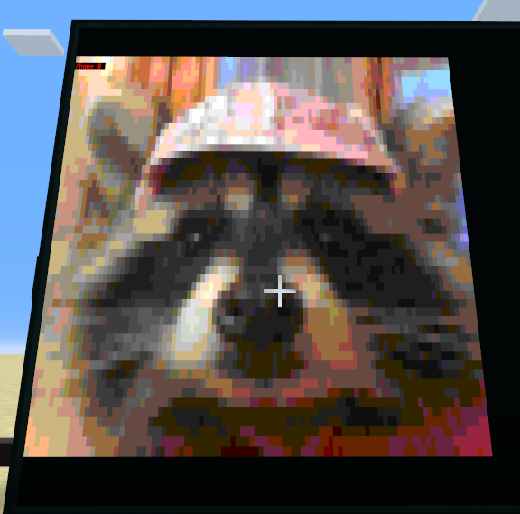
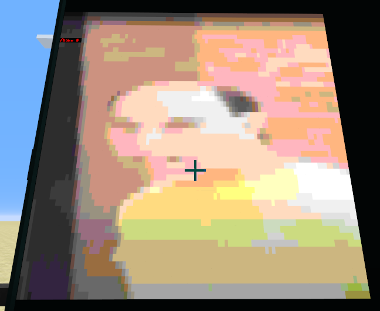

# Open-computers_image
Program that allows you to import images into minecraft and display them on open computers screen

For the python code, you will have to install NumPy and opencv.

https://numpy.org/install/ Numpy: pip install numpy
https://pypi.org/project/opencv-python/ Opencv: pip install opencv-python

command: screendraw <filepath>

